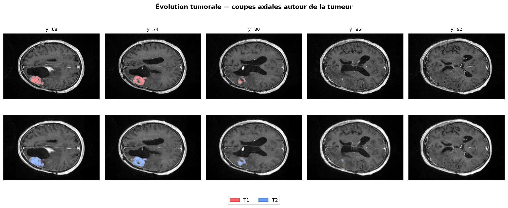
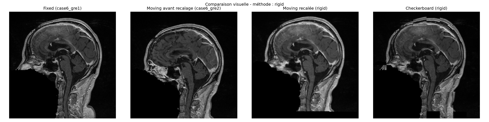
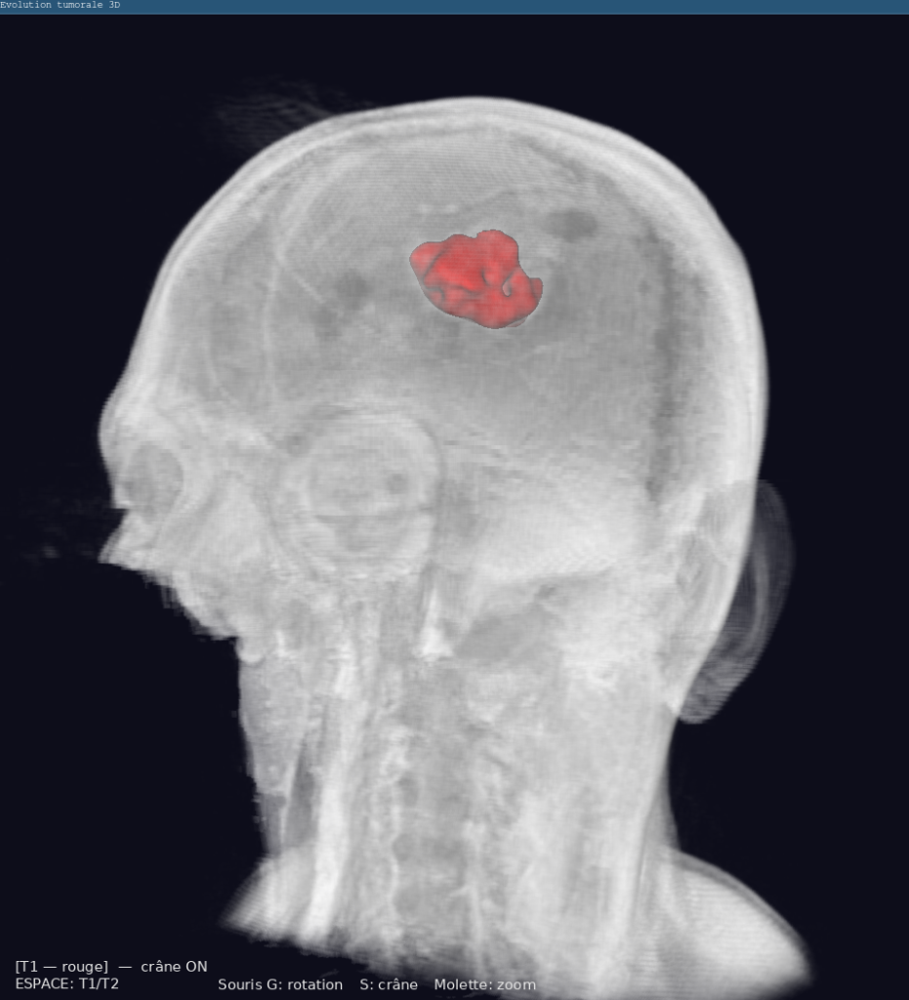

# VTK / ITK Tumor Evolution Analysis

Medical image processing project for the longitudinal analysis of tumor evolution between two 3D acquisitions.

The project uses **ITK** for image registration and segmentation and **VTK** for 3D visualization. The pipeline aligns two volumetric scans, segments the tumor in both acquisitions, compares the resulting regions, and visualizes their evolution.

## Pipeline

1. Load two 3D medical images in NRRD format
2. Register the second acquisition onto the first using ITK
3. Segment the tumor using two-stage Otsu thresholding and connected-component extraction
4. Compute quantitative metrics to analyze tumor evolution
5. Visualize the results in 2D and 3D

## Registration

The registration pipeline supports:

- Translation
- Rigid 3D transformation
- Affine transformation
- Mattes Mutual Information
- Regular Step Gradient Descent optimization
- Multi-resolution registration

Registration quality is evaluated using:

- Mean Squared Error (MSE)
- Normalized Cross-Correlation (NCC)

## Segmentation

Tumor segmentation is performed using:

- Two-stage Otsu thresholding
- Binary mask generation
- Connected-component analysis
- Seed-based selection of the tumor component

Tumor volume is computed using the number of segmented voxels and their physical dimensions.

## Tumor Evolution Analysis

The two segmented tumors are compared using:

- Tumor volume (mm³ / cm³)
- Mean tumor intensity
- Dice similarity coefficient

## Results

### Tumor segmentation



### 3D image registration



### 3D tumor segmentation visualization



## Installation

Using `uv`:

```bash
uv sync
```

Or install the dependencies manually:

```bash
pip install itk vtk numpy
```

## Usage

Run the complete pipeline with:

```bash
uv run python main.py
```

Generated images, segmentation masks, and registered volumes are saved in the `results/` directory. The program also opens an interactive VTK window for 3D visualization.
